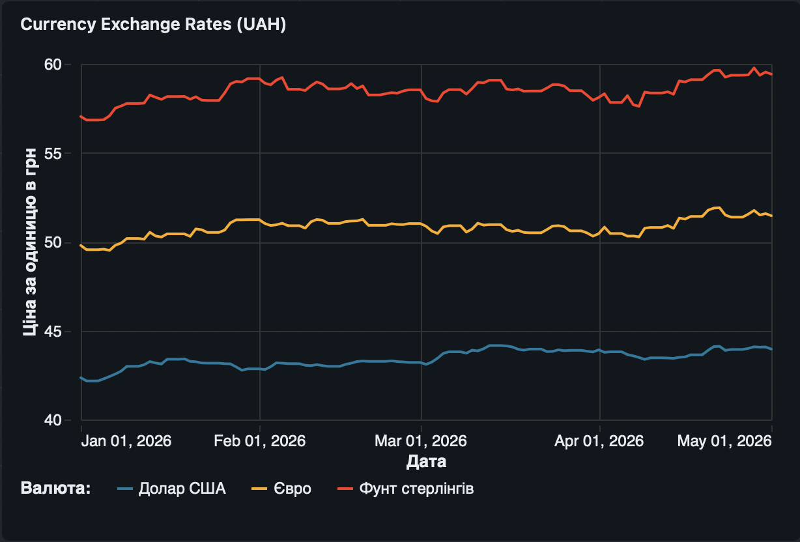

# NBU Exchange Rate ETL
Скрипт завантажує офіційні курси валют НБУ (USD, EUR, GBP, UAH) з 01.01.2026 і зберігає їх у контейнері PostgreSQL.

## Опис папки
* .env - файл з паролями (але на гітхаб я його не вантажу. блокую через .gitignore, тому створила копію файла .env.example для вас, звідки треба скопіювати дані)
* .env.example - паролі для гітхабу (так не можна робити, знаю, то для вас)
* docker-compose.yml - скрипт створення та підключення до контейнера
* exchange_rates.csv - результат, готова таблиця, записана в csv файл
* відповіді_на_додаткові_питання.txt - відповіді
```text
scripts/ 
    --nbu_exchange.py - python скрипт
    --monthly_report.sql - sql скрипт 
docs/
    --connecting_to_container.png 
    --connecting_to_container_2.png - скріншот підʼєднання до контейнеру для написання sql запиту
    --currency_exchange_rates_dashboard.png - скріншот дашборду
    --currency_exchange_rates_dashboard2.png - скріншот дашборду, де курсором показую, що він робочий
також посилання на дашборд 
[]


## Вимоги
- Python 3.11+
- Docker

## Запуск проекту
1. docker-compose up -d #щоб підняти контейнер
2. python nbu_currencies.py #в терміналі 
3. Створюється файл з таблицею
4. Підключення до контейнеру та таблиці через SQL Tools 
5. SQL запит до таблиці
АБО
4. docker exec -i nbu_laba_postgres psql -U admin -d nbu_db < monthly_report.sql #в терміналі (виведе 20 рядків результату SQL запиту)

## Опис скрипту
Скрипт:
- Завантажує курси USD, EUR, GBP з API НБУ
- Генерує курс UAH = 1.0
- Перевіряє пропущені дати і дозавантажує їх
- Зберігає дані у PostgreSQL
- Експортує результат у `exchange_rates.csv`

## Візуалізація
Для візуалізації я завантажила готову таблицю у Databricks, оскільки мені зручно працювати з їхніми дашбордами. Там створила дашборд
